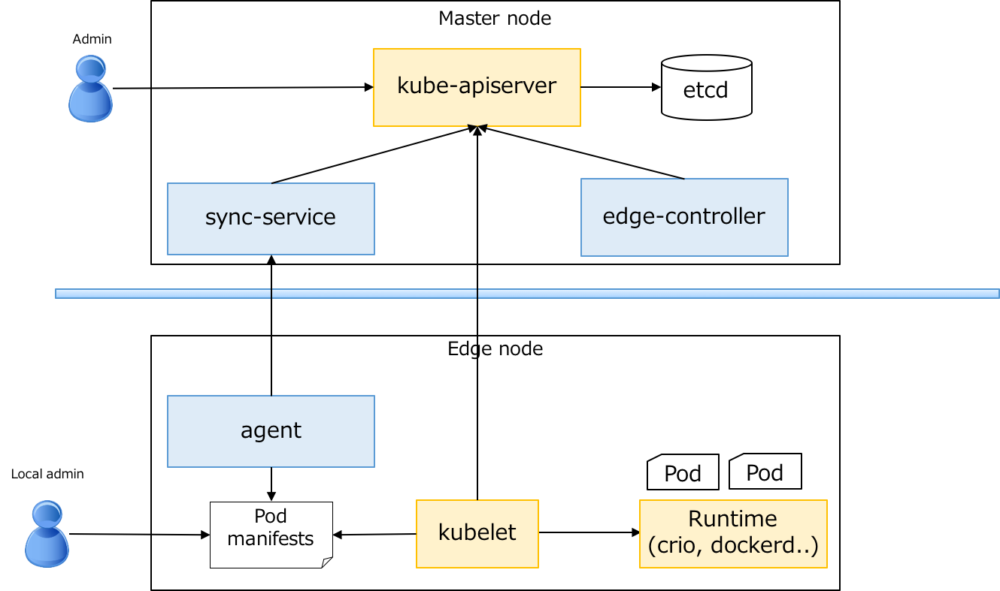

This is just a PoC for deploying and magnaging Pods on edge nodes.

## Architecture


## Quick start
### Prerequisites
You need to have a Kubernetes cluster. If you don't already have a cluster, please create one. Please refer to the [official documents](https://kubernetes.io/docs/setup/) if you are not familiar with Kubernetes.

### Extend the Kubernetes API with CustomResourceDefinition (CRD)
Create CRD to manage EdgeNode resources via kubernetes API:
```shell
$ go get github.com/ohmk/k8s-edge
$ cd $GOPATH/src/github.com/ohmk/k8s-edge
$ cat config/crd.yaml
apiVersion: apiextensions.k8s.io/v1beta1
kind: CustomResourceDefinition
metadata:
  name: edgenodes.edge.k8s.io
spec:
  group: edge.k8s.io
  scope: Namespaced
  names:
    plural: edgenodes
    singular: edgenode
    kind: EdgeNode
  version: v1alpha1
$ kubectl create -f config/crd.yaml
$ kubectl get crds edgenodes.edge.k8s.io
NAME                    CREATED AT
edgenodes.edge.k8s.io   2018-12-04T06:19:50Z
```

### Install and run
Run manager on the master node:
```shell
$ go run cmd/manager/manager.go
INFO[0000] Starting edge manager
INFO[0000] Starting sync service
INFO[0000] Starting edge controller
INFO[0000] Waiting for the informer cache to sync
INFO[0000] Starting sync service api server
INFO[0000] Starting workers
```

Run agent on the edge node:
```shell
$ go run cmd/agent/agent.go --sync-server=<master url>:50051
INFO[0000] Starting edge agent
INFO[0000] Starting sync agent
INFO[0000] Starting sync edge spec
```

### Run Pod applications on the edge node
Create a EdgeNode resource:
```shell
$ kubectl get nodes
NAME      STATUS    ROLES     AGE       VERSION
master    Ready     master    2d        v1.11.2
edge01    Ready     <none>    2d        v1.11.2
$ kubectl create -f example/edge01.yaml
$ kubectl get edgenodes
NAME     AGE
edge01   5s
$ kubectl get pods
NAME           READY   STATUS    RESTARTS   AGE
nginx-edge01   1/1     Running   0          10s
```

Delete a Pod directly:
```shell
$ kubectl delete pods nginx-edge01
$ kubectl get pods
NAME           READY   STATUS    RESTARTS   AGE
nginx-edge01   0/1     Pending   0          4s

// Type again:
$ kubectl get pods
NAME           READY   STATUS    RESTARTS   AGE
nginx-edge01   1/1     Running   0          41s
```

If you'd like to delete a Pod, please delete EdgeNode:
```shell
$ kubectl delete -f example/edge01.yaml
$ kubectl get pods
No resources found.
```

## What's the advantage of this architecture
* You can manage Pod applications even when network failure happens between master and edge nodes.
* You can use your exisiting Kubernetes cluster without any change.
* ...
